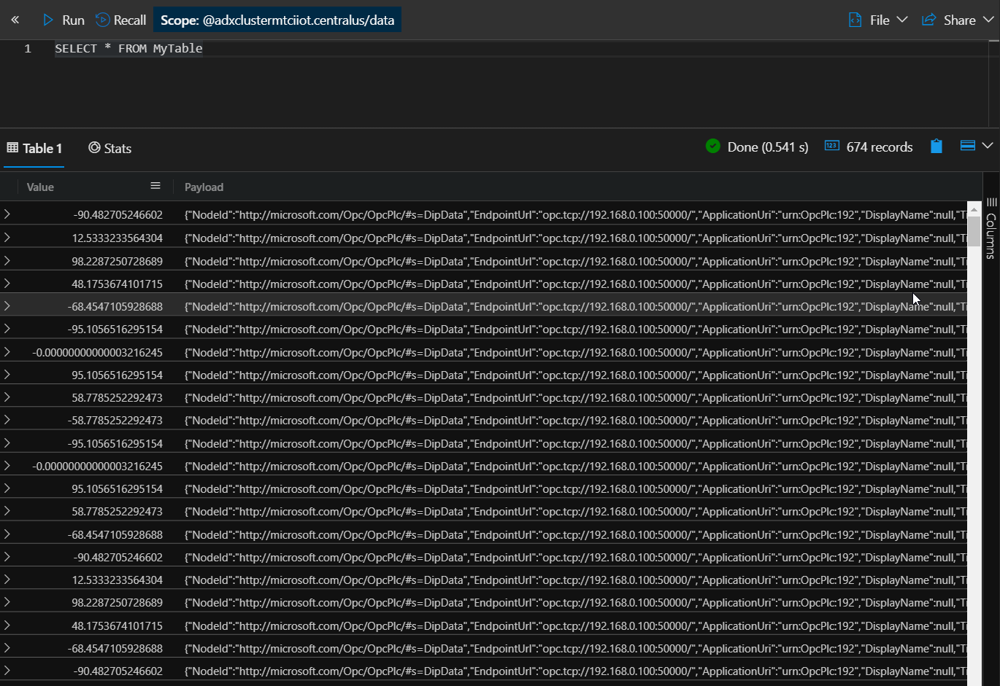

# Process data in ADX

## Intro

This guide will connect published OPC UA data with a deployed Azure Date Explorer service.

## Prerequisites

* [Moxa Gateway Setup](./moxa-gateway-setup.md)
* Gateway internet access
* Gateway SSH connection
* OPC UA Node already publishing

## OPC Data

Depending on your OPC Data, some steps of the tutorial may need to be adjusted. We will use the following published node as reference:

```json
{
  "NodeId": "http://microsoft.com/Opc/OpcPlc/#s=DipData",
  "EndpointUrl": "opc.tcp://192.168.0.100:50000/",
  "ApplicationUri": "urn:OpcPlc:192",
  "DisplayName": null,
  "Timestamp": "2020-04-16T11:18:03.5511918Z",
  "Status": "Good",
  "Value": {
    "Value": -3.2162452993532734E-14,
    "SourceTimestamp": "2020-04-16T11:18:03.5375812Z",
    "ServerTimestamp": "2020-04-16T11:18:03.5376173Z"
  },
  "ExtensionFields": {
    "EndpointId": "uat5ccaee1cdce2d686f96b9dd7fa937e171dabb75b",
    "PublisherId": "uat5ccaee1cdce2d686f96b9dd7fa937e171dabb75b",
    "DataSetWriterId": "uat5ccaee1cdce2d686f96b9dd7fa937e171dabb75b"
  }
}
```

```json
{
  "NodeId": "http://microsoft.com/Opc/OpcPlc/#s=PositiveTrendData",
  "EndpointUrl": "opc.tcp://192.168.0.100:50000/",
  "ApplicationUri": "urn:OpcPlc:192",
  "DisplayName": null,
  "Timestamp": "2020-04-16T11:18:03.5511918Z",
  "Status": "Good",
  "Value": {
    "Value": 2018.00,
    "SourceTimestamp": "2020-04-16T11:18:03.5375812Z",
    "ServerTimestamp": "2020-04-16T11:18:03.5376173Z"
  },
  "ExtensionFields": {
    "EndpointId": "uat5ccaee1cdce2d686f96b9dd7fa937e171dabb75b",
    "PublisherId": "uat5ccaee1cdce2d686f96b9dd7fa937e171dabb75b",
    "DataSetWriterId": "uat5ccaee1cdce2d686f96b9dd7fa937e171dabb75b"
  }
}
```


## Steps

1. Deploy an `Azure Date Explorer Cluster` service in your resource group (This may takes some time)
1. Visit the Eventhub Namespace of your Resource Group
    1. Click on your EventHub and add a Consumer Group `opc-data`
1. Visit the IoT Hub of your Resource Group
    1. On `Message Routing`, add the event hub + consumer group as a new `Custom Endpoint`
    1. Still on `Message Routing`, add a new route of all telemetry messages to the newly created EventHub endpoint
1. Visit your newly created `Azure Date Explorer` service
    1. Create a database with a name of your choice and navigate to it via `Databases` on the left
    1. Create a table within that database using the `Query` tab on the right
        ```sql
        .create table MyTable ( Timestamp:datetime, Value:real, NodeID:string )
        ```
    1. Create a json mapping for your table:
        ```sql
        .create-or-alter table MyTable ingestion json mapping "MyTableMapping"
        '['
        '    { "column" : "Value", "Properties":{"Path":"$.Value.Value"}},'
        '    { "column" : "NodeID", "Properties":{"Path":"$.NodeId"}},'
        '    { "column" : "Timestamp", "Properties":{"Path":"$.Timestamp"}}'
        ']'
        ```
    1. Create a new `Data Ingestion` entry with the following values:
        | Key | Value |
        |---:|---|
        |  Connection Type | EventHub  |
        |  Data Connection Name | `opc-data`  |
        |  Event Hub Namespace | Your EH Namespace  |
        |  Event Hub | Your EH  |
        |  Consumer Group | `opc-data` |
        |  Compression | None |
        |  Table | MyTable |
        |  Data Format | JSON |
        |  Column Mapping | MyTableMapping |
1. After some Minutes, try the following query:
```sql
SELECT * FROM MyTable
```



## Example Queries

### Render both data points

```sql
MyTable
| render linechart 
```

### Render specifc data point

```sql
MyTable
| where NodeID == 'http://microsoft.com/Opc/OpcPlc/#s=PositiveTrendData'
| render linechart 
```

### Detect Anomalies

```sql
MyTable
| where NodeID == 'http://microsoft.com/Opc/OpcPlc/#s=DipData'
| summarize Values = make_list(Value)
| extend series_decompose_anomalies(Values)
| mv-expand Values, series_decompose_anomalies_Values_ad_flag
| project Values, series_decompose_anomalies_Values_ad_flag
```
