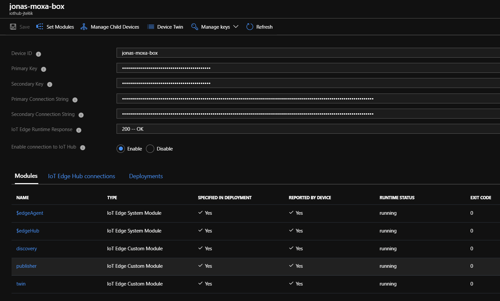

# Register Gateway in IoT Hub

## Introduction

In this module we will register the gateway in our IoT Hub.

## Steps

### IoT Hub Edge Device

* Find your `IoT Hub` and click on the tab `IoT Edge`
* On clicking `Add an IoT Edge Device`, fill it with following properties:
  * `DeviceID = device-name`
* When the device is created, click on it:
  * Edit the `Device Twin` and add the following as a root property to the JSON:
    ```json
    "tags": {
      "os": "Linux",
      "__type__": "iiotedge"
    },
    ```
  * Make note of the `Primary Connection String` in the overview of the device.

👉 **Hint!** By specifying `"tags.__type__": "iiotedge"`, a layered deployment will be assigned to this device, which will contain all required modules for the IIoT setup. You can also add your own modules by specyfing them in an additional layered deployment. You can read more about layered deployments [here](https://docs.microsoft.com/en-us/azure/iot-edge/module-deployment-monitoring#layered-deployment).

👉 **Warning!** Do not edit the modules manually via `Set Modules`! Your changes will be overwritten by the layered deployment.

### IoT Edge Runtime Configuration

* SSH into your gateway of choice
* Edit `/etc/iotedge/config.yaml` and fill out the following part:

  ```yaml
  # Make sure the following lines are uncommented
  provisioning:
    source: "manual"
    device_connection_string: "<PRIMARY CONNECTION STRING>"
    dynamic_reprovisioning: false
  ```
* Restart your iotedge runtime `sudo systemctl restart iotedge`

### Results

To check if the setup was successful, check the module count and status in your edge dashboard:


